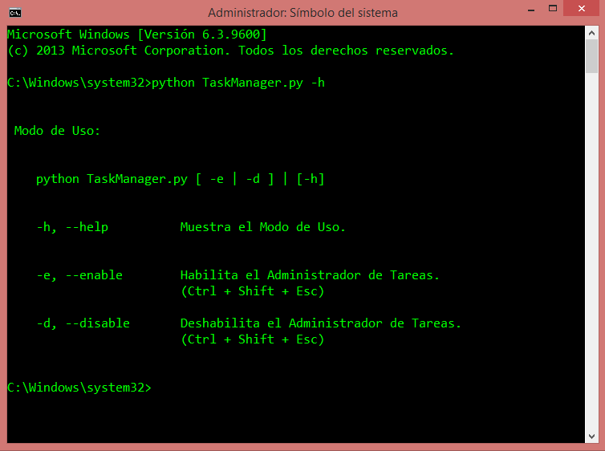
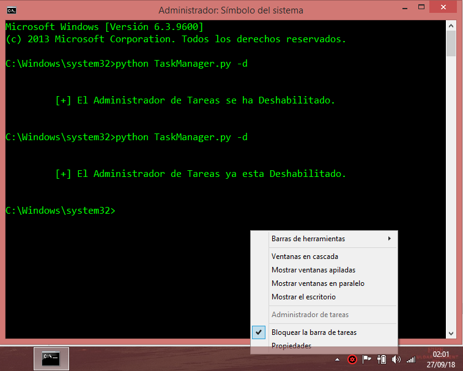
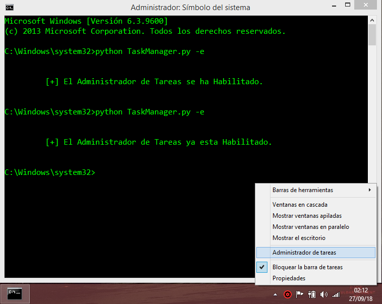

# TaskManager v1.2.0
## Deshabilita o Habilita el Administrador de Tareas de Windows.
## Versión: Python 3
## OS: Windows
## By: LawlietJH

- - -

### Requerimientos:

___Correr en consola con permisos de Administrador.___

- - -

### Modo de Uso:
    
    python  TaskManager.py  [ -e | -d ] | [-h]
    
    
    -h, --help          Muestra el Modo de Uso.
    
    
    -e, --enable        Habilita el Administrador de Tareas.
    
    
    -d, --disable       Deshabilita el Administrador de Tareas.
    
- - -

### Atajos para abrir el Administrador de Tareas (Task Manager):

  * __Presionar _'Ctrl + Shift + Esc'._ (_Shift Izquierdo_ o _Mayus Izquierdo_).__
  * __Presionar _'Ctrl + Alt + Supr'_ y luego en _"Administrador de tareas"_.__
  * __Presionar _'Win + R'_ para abrir la ventana _'Ejecutar'_ y escribir _'taskmgr'_ y presionar _'Enter'_. (_Win_ es la tecla de Windows).__
  * __Clic derecho en la barra de tareas y luego clic en _"Administrador de tareas"_.__
  * __Ejecutar directamente el ejecutable en la ruta: _'C:/Windows/System32/taskmgr.exe'_.__
  * __Colocar la ruta  _'C:/Windows/System32/taskmgr.exe'_ directamente en la barra de direcciones del explorador de Windows.__
    * __El explorador de Windows se puede abrir presionando _'Win + E'_.__
  * __Abrir ventana de comandos (Shell) cmd y escribir _'taskmgr'_ y presionar _'Enter'_.__

- - -

### Nota:
__Si alguno de estos métodos no funciona, debe ser porque el Administrador de tareas debe estar deshabilitado, si es así, ejecuta este Script desde una ventana de comandos cmd (con permisos de administrador) con el comando _python TaskManager.py --enable_ para habilitarlo.__

- - -

### Capturas:

__TaskManager.py -h__

__TaskManager.py -d__

__TaskManager.py -e__

